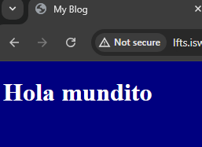

[< Volver al Indice](/docs/readme.md)

# ***Include CSS and JavaScript***

En Laravel, podemos manejar archivos CSS y JavaScript de manera clásica y simple colocándolos en carpetas públicas accesibles:

* Crear archivo CSS:
  * Crea un archivo llamado app.css en la carpeta /public de tu proyecto Laravel.

``` css
  body{
background-color: navy;
color: white;
}
```
 * Crear archivo JavaScript:
   *  Crea un archivo llamado app.js en la misma carpeta /public.
  
``` javascript
alert('Estoy aqui my friend');
```

Modificamos la vista _Welcome_ con el siguiente codigo:


```HTML
<!DOCTYPE html>
<html lang="en">
<head>
    <meta charset="UTF-8">
    <meta name="viewport" content="width=device-width, initial-scale=1.0">
    <link rel= "stylesheet" href="/app.css">
    <script src="/app.js"></script>
    <title>My Blog</title>
</head>
<body>
    <h1> Hola mundito </h1>
    
</body>
</html>
```
 La vista final luce asi:


 *  Le damos "ok" para pasar a la siguiente vista:
  
