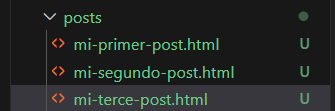

[< Volver al Indice](/docs/readme.md)

# ***Store Blog Post as HTML Files***

* Modificamos el archivo post.blade.php para que sea más dinamica y eficiente las rutas del post y de esta manera almacenar estos mismos como archivos HTML:

```php
<!DOCTYPE html>
<html lang="en">
<head>
    <meta charset="UTF-8">
    <meta name="viewport" content="width=device-width, initial-scale=1.0">
    <link rel= "stylesheet" href="/app.css">
    <title>My Blog</title>
</head>
<body>
    <article>
        
    <?= $post; ?>

    </article>

    <a href="/">Go back</a>
</body>
</html>
```

* Modificamos el archivo web.php:

```php
Route::get('post', function () {
        return view('post', [
            'post' => '<h2>Hola mundillo</h1>' // $post
        ]);
    });
```


* Despues de las modificaciones, lo que hacemos es crear una carpeta que se llamará post dentro de la carpeta de resources y en esa carpeta de post crearemos tres archivos HTML:



  * En cada unos de estos HTML escribiremos su respectivo post.


* Por ultimo, modificamos el archivo web.php, aqui lo que se ejecuta es que se pueda mover entre los almacenados en HTML de forma mas dinamica.


